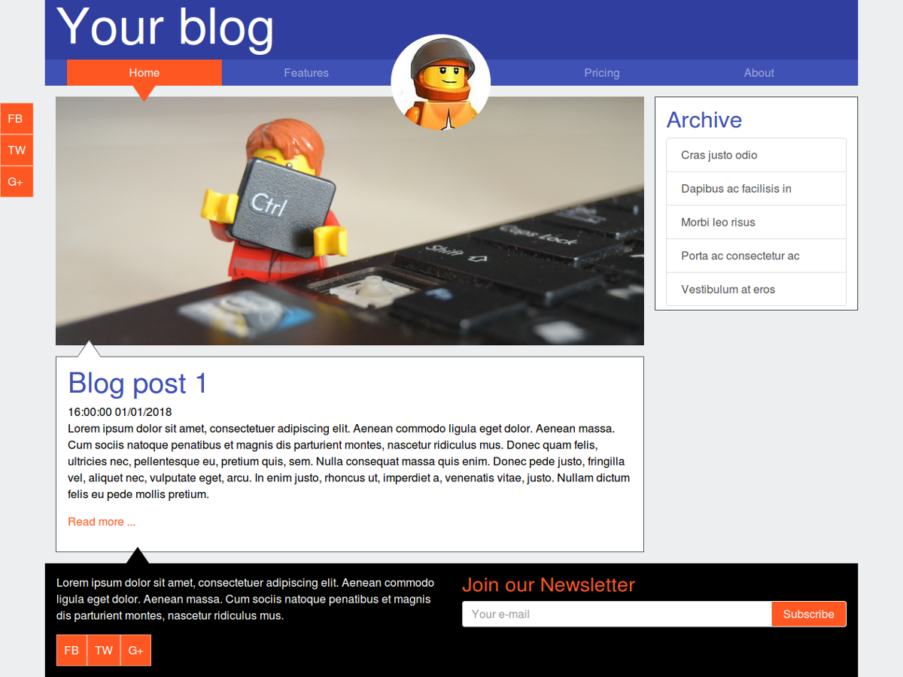
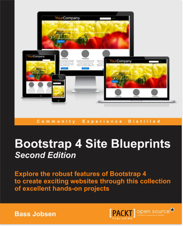

### JBST Weblog theme
Wordpress theme build with Bootstrap 4 and JBST 4.

.

### Bootstrap 4 Site Blueprints
JBST Weblog theme shows how to build a custom Wordpress theme with Bootstrap 4 and JBST 4. I explain the process and code in more detail in [my 
book].

.

### Getting Started With Gulp
- Install [node.js](https://nodejs.org).
- Install [bower](http://bower.io).
- Using the command line, navigate to your theme directory
- Run `npm install`
- Run `gulp` to confirm everything is working

### Credits
- Forked from and thanks to [JBST 4](https://github.com/bassjobsen/jbst-4-sass)
- HTML and SCSS inspired by [JBST 4](https://github.com/bassjobsen/bootstrap-weblog)
- [Bootstrap](http://getbootstrap.com/)
